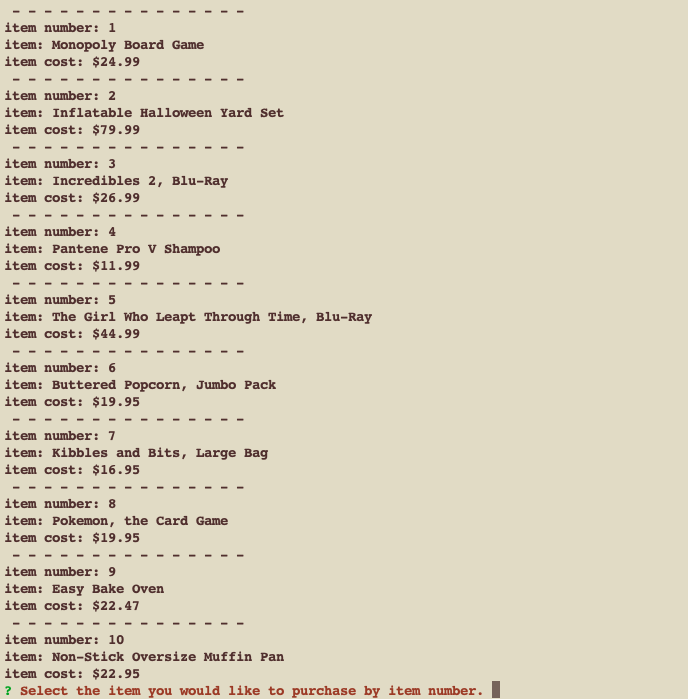
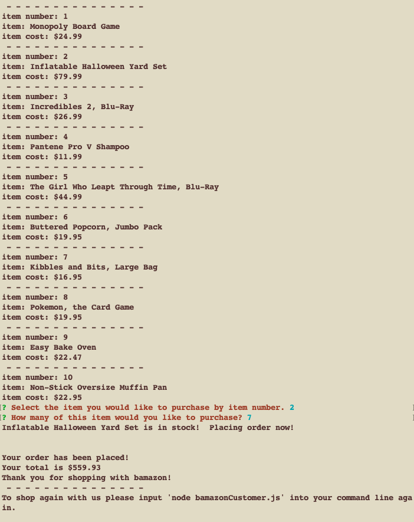
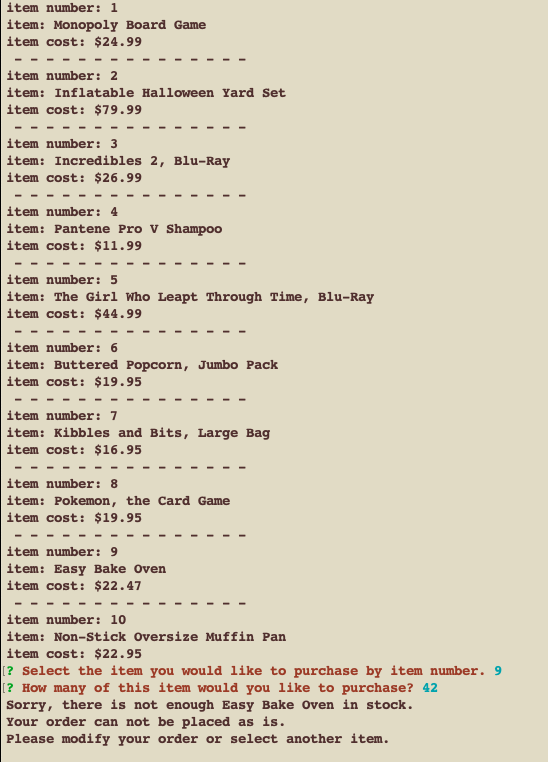

# HW-Node-MySQL

# Week 12 homework assignment:
## Node.js & MySQL

### Introduction

* I created an Amazon-like storefront app, called Bamazon, using MySQL, the MySQL NPM Package, and the Prompt Package.
* This app takes in orders from customers and depletes from the store's total supplies.
* The app first displays a list of all of the available products and their costs.

##### The app asks the following things from the user.

	* product ID
	* the amount the user wants to purchase
    * lists the complete order information, tells if the item is in stock along with the total


##### The app will respond if your order cannot be filled.

	* lists number ordered and quantity
    * states that there is not enough of the item to fullfill the order
    * asks user to modify the order or select another item


* It must be ran in the command line.
* Type in node main.js to start the app.

* These are the npm packages I used and are needed to run the app

	* fs package in node
	* [prompt](https://www.npmjs.com/package/prompt)
	* [mysql](https://www.npmjs.com/package/mysql)
	
* to install these npm packages run the following command.
```
npm install 

```

* if that does not work run these commands one at a time.
```
npm install prompt
npm install mysql